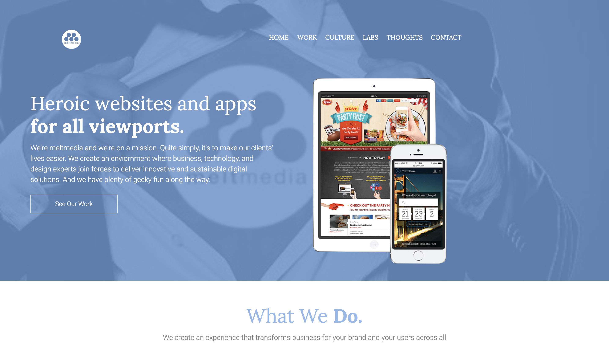
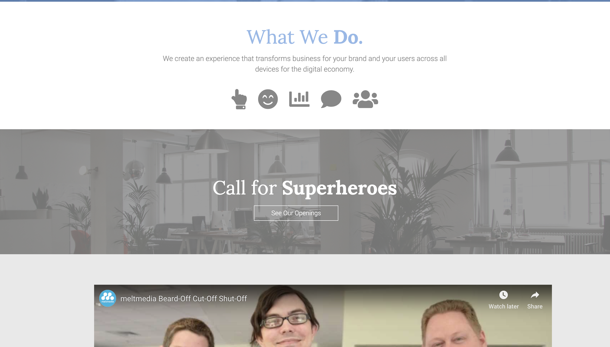
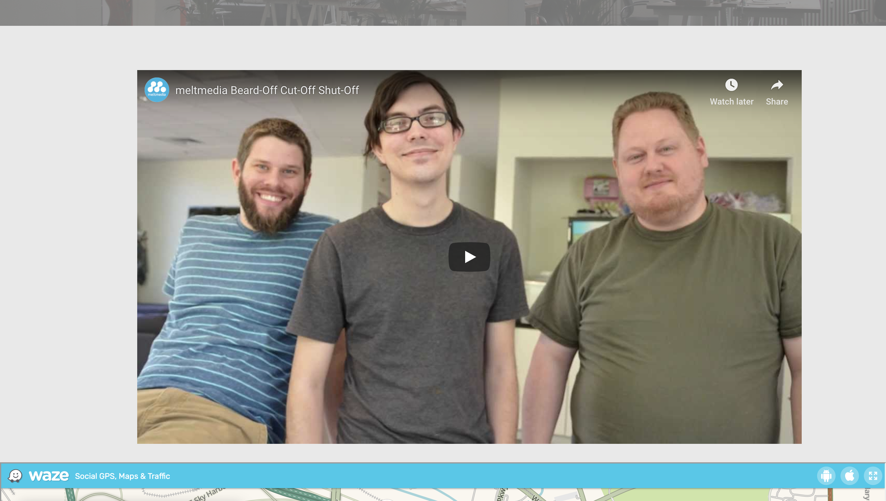
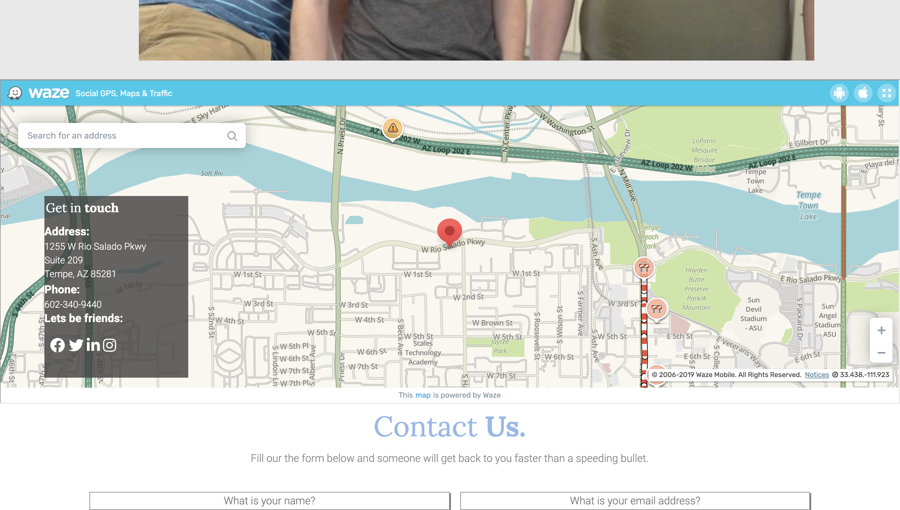
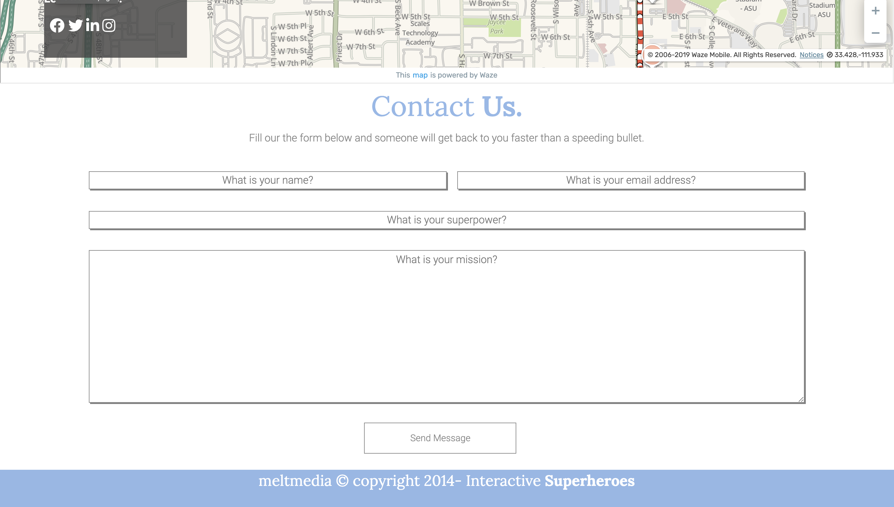
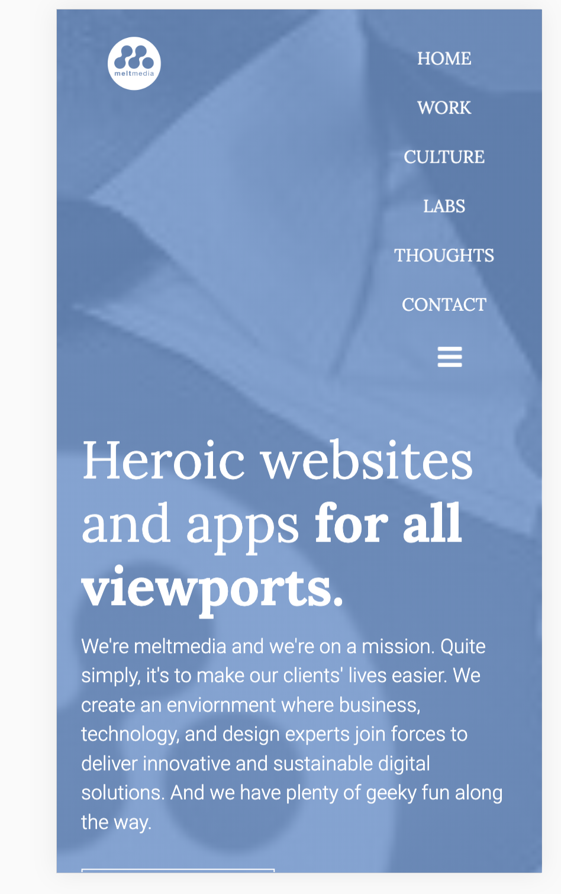
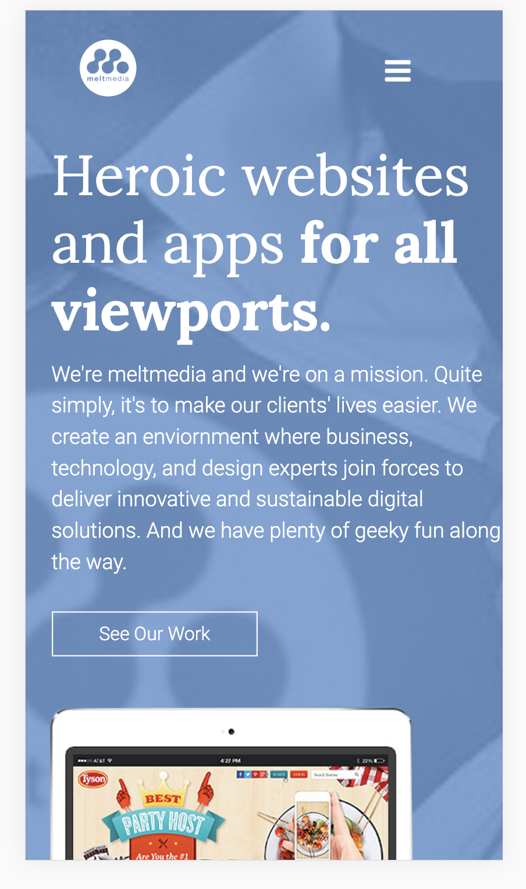
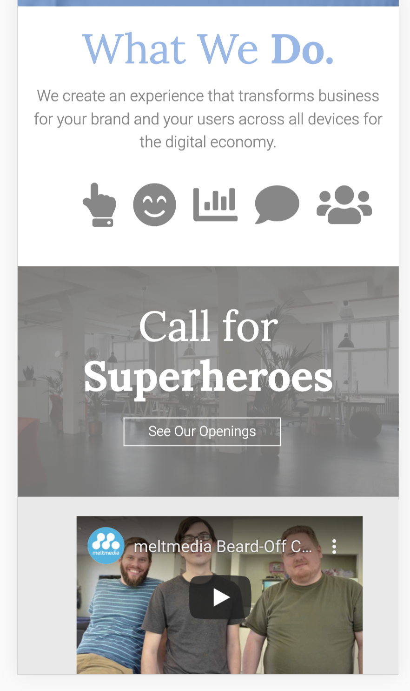
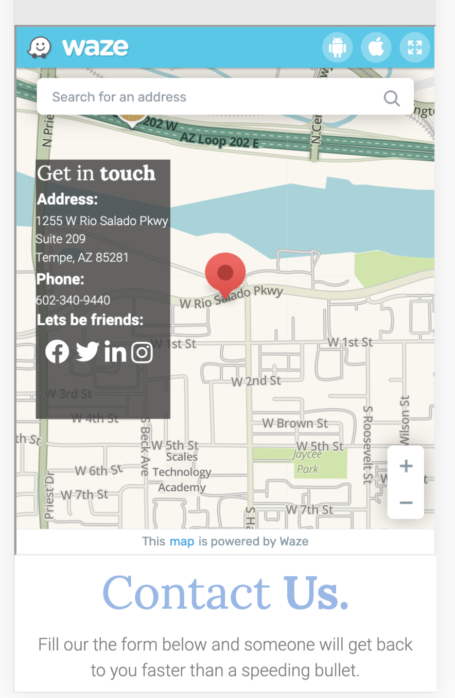
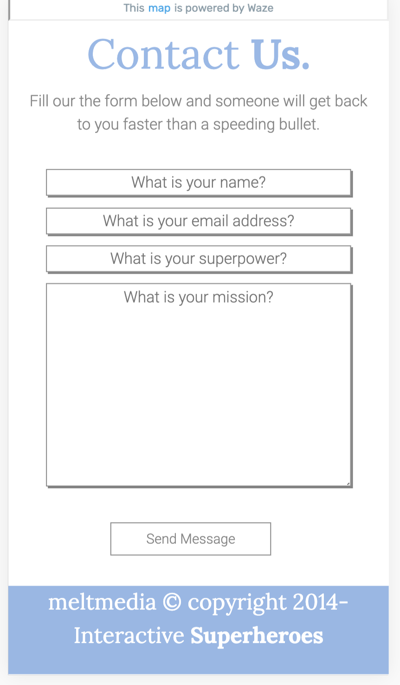

# melt-internship

https://naenae15232.github.io/melt-internship/

## This is a fully responsive, but static webpage designed off of a PDF visual for an internship application. It utilizes HTML, CSS, and JavaScript. Some images were made using photoshop and others were obtained from pexels.com along with the icons being sourced from Font Awesome.

### A few screen shots of the webpage in full screen

### A few screen shots of the webpage in mobile to show the responsiveness

